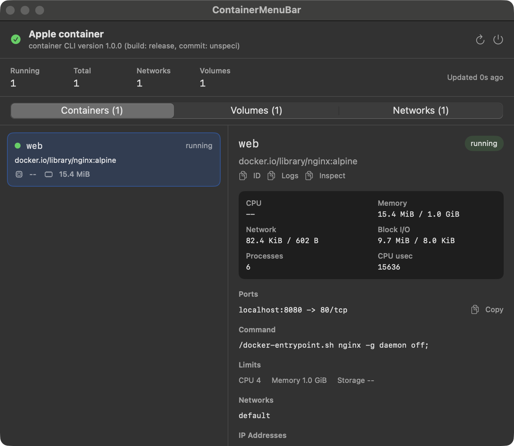
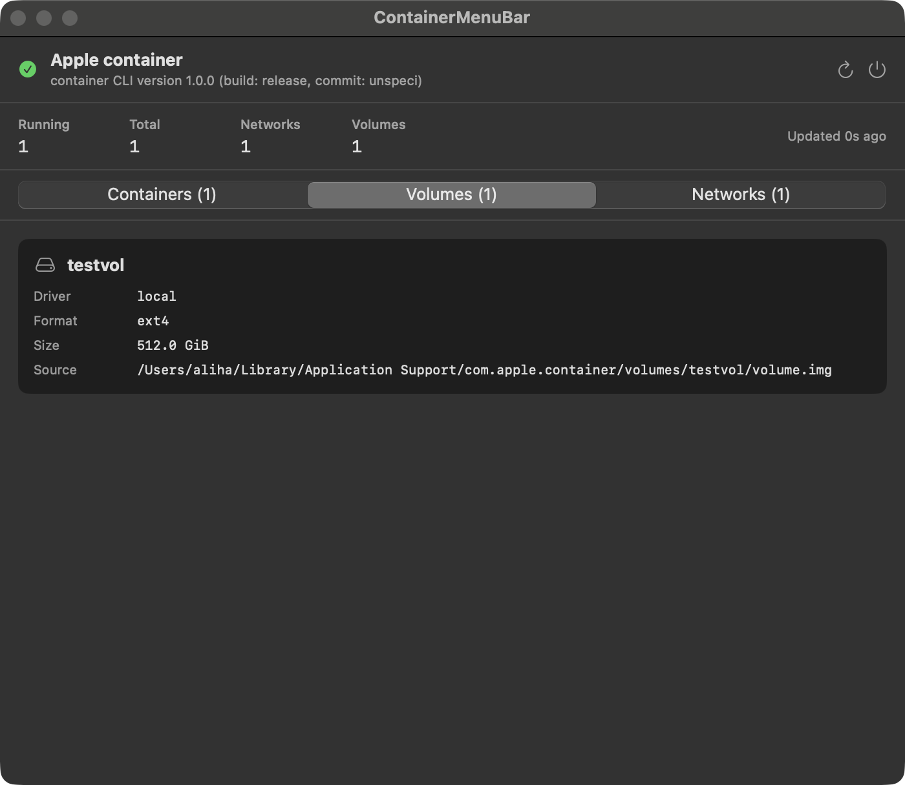
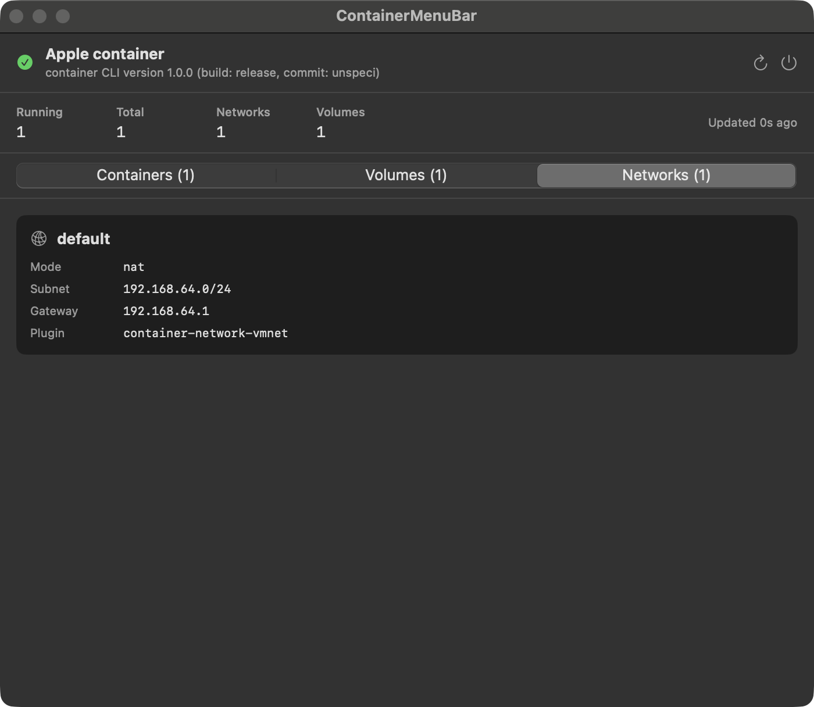

# ContainerMenuBar

[](https://github.com/hurryingauto3/container-mb/actions/workflows/ci.yml)
[](https://github.com/hurryingauto3/container-mb/releases/latest)
[](LICENSE)
[](#requirements)
[](https://swift.org)

A lightweight, **read-only** macOS menu-bar monitor for Apple's
[`container`](https://github.com/apple/container) runtime. It shows your
containers, volumes, and networks at a glance — live stats, ports, mounts,
IPs, and more — without ever mutating runtime state.

> **Unofficial project.** Not affiliated with or endorsed by Apple. It observes
> the installed `container` CLI as an external process; it does not link Apple's
> `container` Swift package and does not run a background helper service.

## Screenshots

| Containers | Volumes | Networks |
| --- | --- | --- |
|  |  |  |

## Features

- **Containers** — running state, image, CPU %, memory, network/block I/O,
  process count, published ports, command, resource limits, networks, IP
  addresses, mounts, and labels.
- **Volumes** — driver, format, size, and source path.
- **Networks** — mode, subnet, gateway, and plugin.
- **Menu-bar glance** — running/total count without opening the window.
- **Efficient polling** — the expensive `stats` call is skipped on background
  polls unless the container set changes; 5 s when open, 30 s when closed.
- **Resilient parsing** — defends against CLI output shape drift and degrades to
  the last good snapshot on error.

## Requirements

- macOS 13 (Ventura) or later, Apple silicon recommended.
- Apple [`container`](https://github.com/apple/container) installed and on a
  standard path (`/usr/local/bin`, `/opt/homebrew/bin`, `/usr/bin`, or `PATH`).
  Start it with `container system start`.
- To build from source: a Swift 5.9+ toolchain (Xcode 15+ / Command Line Tools).

## Install

### Download a release (recommended)

1. Download `ContainerMenuBar.app.zip` from the
   [latest release](https://github.com/hurryingauto3/container-mb/releases/latest).
2. Unzip and move `ContainerMenuBar.app` to `/Applications`.
3. Launch it. The version you are running is shown in the window header and in
   *Finder → Get Info*.

> Release builds are ad-hoc signed, not yet notarized. See
> [SECURITY.md](SECURITY.md#installing-safely) for how to verify a download and
> what Gatekeeper will show.

### Build and install from source

```sh
git clone https://github.com/hurryingauto3/container-mb.git
cd container-mb
make install      # builds a release bundle and copies it to /Applications
```

## Usage

```sh
make build        # swift build
make test         # run the smoke-test suite
make run          # build and launch the app
make package      # build a signed dist/ContainerMenuBar.app
make install      # package and copy to /Applications
make clean
```

It is a menu-bar app: look for the box icon in the top-right menu bar (it shows
`ctr <running>`). Click it to open the dashboard; switch between Containers,
Volumes, and Networks with the segmented control.

## Versioning

The version is defined once in
[`Sources/ContainerCore/AppVersion.swift`](Sources/ContainerCore/AppVersion.swift)
and flows into the bundle's `CFBundleShortVersionString`, the in-app header, and
the git release tag. The project follows [Semantic Versioning](https://semver.org)
and a [Keep a Changelog](https://keepachangelog.com)-style
[CHANGELOG.md](CHANGELOG.md).

## Architecture

See [CLAUDE.md](CLAUDE.md) for a detailed map. In short: a UI-free `ContainerCore`
library (models, CLI client, polling) drives a thin AppKit/SwiftUI shell. The
CLI is treated as the stable API boundary; all parsing is centralized and
defensive.

## Contributing

Contributions are welcome — please read [CONTRIBUTING.md](CONTRIBUTING.md) and
our [Code of Conduct](CODE_OF_CONDUCT.md).

## Security

Found a vulnerability? Please follow the process in [SECURITY.md](SECURITY.md);
do not open a public issue for security reports.

## License

Licensed under the [Apache License 2.0](LICENSE). See [NOTICE](NOTICE) for
attribution.
